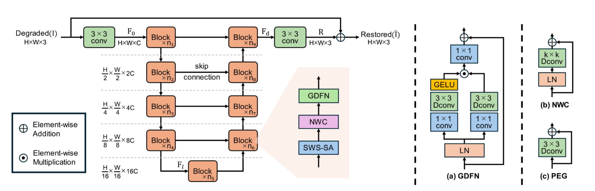
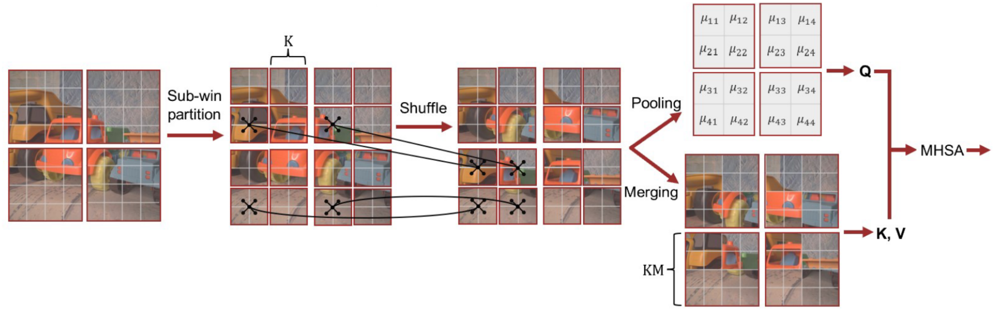

Please visit [github](https://github.com/n-okt/SWSformer) if you are currently viewing a github-pages.

## SWSformer: Subwindow Shuffle Transformer for Image Restoration

This is the official PyTorch implementation of the paper [SWSformer: Subwindow Shuffle Transformer for Image Restoration (IEEE Access, 2025)](https://ieeexplore.ieee.org/document/11202932?source=authoralert)

> **Abstract:** Transformers have demonstrated superior performance over conventional methods in various tasks due to their ability to capture long-range dependencies and adaptively generate weights. However, their computational complexity increases quadratically with the number of tokens, limiting their applicability to high-resolution image tasks. To address this problem, recent image restoration methods have attempted to mitigate this limitation by adopting mechanisms that reduce computational demands at the expense of fully capturing long-range dependencies.
In contrast, the window shuffle self-attention (WS-SA) mechanism of the Shuffle Transformer reduces computational complexity without significantly limiting the ability to capture long-range dependencies. Nevertheless, WS-SA suffers from generating excessively sparse self-attention maps with a limited receptive field when applied to high-resolution images.
In this work, we propose subwindow shuffle self-attention (SWS-SA), a mechanism that expands the receptive field without increasing the computational complexity of WS-SA. SWS-SA introduces a subwindow-based spatial shuffle to enhance the receptive field. Additionally, we apply average pooling to the query embeddings to further reduce computational complexity.
Furthermore, we present the Subwindow Shuffle Transformer (SWSformer), which employs SWS-SA as its core component and integrates effective techniques from related works. To evaluate the performance of SWSformer, we conduct experiments on image denoising, deblurring, and deraining tasks. The experimental results demonstrate that SWSformer achieves state-of-the-art performance. Moreover, we perform comprehensive ablation studies to identify the contributions of individual components and settings to the model's overall effectiveness.

## Overall pipeline
<p align="center">
   

## subwindow shuffle self-attention
<p align="center">
   
  
## Installation
```python
python 3.8.10
pytorch 2.1.0
cuda 12.1
```

Clone our repository and then install dependencies and basicsr:
```bash
git clone https://github.com/n-okt/SWSformer.git
cd SWSformer
pip install -r requirements.txt
python setup.py develop --no_cuda_ext
```

## Training and Evaluation
|Task|Dataset|Instructions|
|:----|:----|-----|
|Image Denoising|SIDD| <p align="center"> [Link](./docs/SIDD.md) |
|Image Deblurring|GoPro| <p align="center"> [Link](./docs/GoPro.md) |
|Image Deraining|Rain100H| <p align="center"> [Link](./docs/Rain100H.md) |
|Low-light enhancement|LOLv2| <p align="center"> [Link](./docs/LOLv2.md) |
|Multi-weather Nighttime image restoration|AllWeatherNight| <p align="center"> [Link](./docs/AllWeatherNight.md) |

* Restoration results in our experiments can be found here: [IEEE DataPort](https://ieee-dataport.org/documents/swsformer)
* A checkpoint for SWSformer trained on the SIDD with large number of epochs can be found here: [Google Drive](https://drive.google.com/file/d/1GarJxMwDT6m74NLa2UCMV1YMhb7xsUX1/view)

## Citation
If you use SWSformer, please consider citing:

```
@article{Okitsu2025SWSformer,
  title={SWSformer: Subwindow Shuffle Transformer for Image Restoration},
  author={Nagayuki Okitsu and Masato Shirai},
  journal={IEEE Access},
  volume={13},
  pages={178876-178892},
  year={2025},
  doi={10.1109/ACCESS.2025.3621348}
}
```

## Contact

If you have any question, please contact shirai@cis.shimane-u.ac.jp

**Acknowledgment:** This code is based on the BasicSR, Shuffle Transformer, Restormer, NAFNet, and CGNet.

